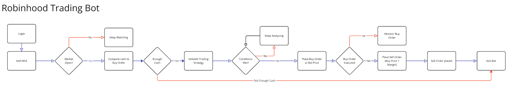

### Trading Bot Documentation

**Project Manager:** Muhammad Nauman Sair\
[GitHub Profile](https://github.com/mnsair) |
[X Profile](https://x.com/NaumanSair) |
[Kaggle Profile](https://www.kaggle.com/muhammadsair)

> **Disclaimer:** This documentation and trading bot are intended solely for educational and demonstrative purposes. **This is not financial advice, and the strategy described is not guaranteed to be profitable.** In fact, the strategy may result in financial losses. Use it at your own risk.

## 📚 **Overview**
This document explains the three key components of the trading bot system: **Credentials**, **Strategy**, and **Trading Bot**. Each section outlines the purpose, functionality, and flow of the system.

---

## 🔑 **1. Credentials**
### Purpose:
- Securely store and manage user credentials (username, password, and MFA code) for authenticating with Robinhood.
- Ensure sensitive data is not hardcoded into the trading bot or strategy files.

### Key Steps:
1. **Login Functionality:**
   - Prompts the user for an MFA code during the initial login.
   - Saves the session details securely in a `session.pickle` file.
2. **Session Restoration:**
   - Checks if a session file exists.
   - Restores the session automatically without requiring repeated authentication.

### File Reference:
- **File:** `credentials.py`
- **Functions:** `login()`

---

## 📊 **2. Strategy**
### Purpose:
- Define the trading conditions for placing buy and sell orders.
- Use technical indicators to identify optimal entry points.

### Key Steps:
1. **Fetch Live Data:**
   - Retrieve stock data using **Yahoo Finance** for both 1-minute and 5-minute intervals.
2. **Calculate Indicators:**
   - **5-Minute Chart:** Check if the **9EMA** is above the **VWAP**.
   - **1-Minute Chart:** Validate if **9EMA** crosses above **50SMA**.
3. **Monitor Buy Order:**
   - After placing a **buy order**, monitor until it is marked as `filled`.
4. **Place Sell Order:**
   - Once the buy order is executed, place a **sell order** with a set profit margin.
5. **Bot Termination:**
   - After the sell order is successfully executed, the bot will terminate.

### File Reference:
- **File:** `strategy.py`
- **Functions:**
   - `check_trading_conditions()`
   - `monitor_order()`
   - `execute_trade()`

### Technical Indicators:
- **9EMA (Exponential Moving Average)**
- **VWAP (Volume Weighted Average Price)**
- **50SMA (Simple Moving Average)**

> **Disclaimer:** This strategy is intended solely for building and demonstrating a Robinhood trading bot. **Yahoo Finance** is used to fetch **1-minute interval data** because **Robinhood does not support 1-minute data intervals**.

---

## 🤖 **3. Trading Bot**
### Purpose:
- Orchestrate the entire trading flow.
- Handle login, check market hours, and execute the trading strategy.

### Key Steps:
1. **Authentication:**
   - Login to Robinhood using credentials.
   - Restore session if available.
2. **Market Hours Validation:**
   - Ensure the bot operates only during **live trading hours** (Monday to Friday, 9:00 AM - 4:00 PM EST).
3. **Execute Strategy:**
   - Call the `execute_trade()` function from the strategy module.
4. **Retry Logic:**
   - Handle exceptions gracefully.
   - Retry trading execution in case of temporary errors.
5. **Bot Termination:**
   - Automatically stop the bot after the **sell order** is successfully executed.

### File Reference:
- **File:** `trading_bot.py`
- **Functions:**
   - `login()`
   - `is_market_closed()`
   - `main()`

### Flow Diagram:


---

## 🛠️ **4. How to Use the Bot**
### **Buy Conditions:**
This bot is built to **buy one share** once the following conditions are met in sequence:
1. **9 EMA is above VWAP** on the **5-minute daily chart**.
2. **9 EMA crosses above 50 SMA** on the **1-minute daily chart**.

### **Ticker:**
- Update the **ticker symbol** in both `Strategy.py` and `Trading_bot.py` files.
- Replace the default ticker (`AAPL`, `NVDA`, etc.) with your preferred stock ticker.

### **Sell Order:**
- A **sell order** is automatically placed based on the **buy price + margin** (user-defined profit margin).
- Once the **sell order** is executed, the bot will **terminate automatically**.

### **Clear Cache and Restart:**
- After the sell order execution, clear cached sessions (`session.pickle`) if needed.
- Restart the bot manually.

### **Manually Terminate the Bot:**
- If required, manually stop the bot by pressing **`Ctrl + C`** (in VSCode Python terminal).

---

## 🛠️ **5. Python Libraries Used**
1. **robin_stocks.robinhood**: Interface with the Robinhood API for stock trading operations.
2. **pandas**: Data manipulation and analysis, used for indicator calculations.
3. **yfinance**: Fetch historical and live stock data from Yahoo Finance.
4. **time**: Manage delays and time-based monitoring.
5. **sys**: Handle system-level operations and bot termination.
6. **datetime**: Manage and validate trading hours.
7. **pickle**: Save and restore session data securely.

To install the required libraries, run:
```bash
pip install robin_stocks pandas yfinance
```

---

## 🛡️ **6. Safety Measures**
- **Session Management:** Secure storage using `session.pickle`.
- **Timeouts:** Ensures the bot doesn’t hang indefinitely during order monitoring.
- **Error Handling:** Retries failed tasks and logs clear error messages.

---

## 💻 **7. Setting Up the Environment**
1. **Install Visual Studio Code (VSCode):**
   - [Download VSCode](https://code.visualstudio.com/)
2. **Install Python:**
   - [Download Python](https://www.python.org/downloads/)
   - Ensure `pip` is installed.
3. **Create a Virtual Environment:**
   ```bash
   python -m venv trading_bot_env
   ```
4. **Activate Virtual Environment:**
   - **Windows:** `.\trading_bot_env\Scripts\activate`
   - **macOS/Linux:** `source trading_bot_env/bin/activate`
5. **Install Dependencies:**
   ```bash
   pip install robin_stocks pandas yfinance
   ```

---

## 🎯 **8. Conclusion**
This trading bot integrates **live data fetching**, **technical indicators**, and **automated order placement** to execute a robust trading strategy. Ensure proper monitoring and market awareness while using the bot.

Happy Trading! 📈

